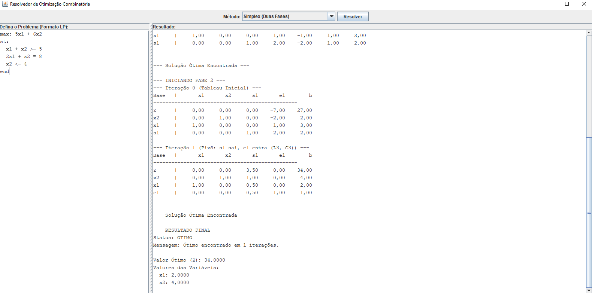

# 🔷 OptiLab: Ferramenta Interativa de Otimização em Java


## 🎓 Sobre o Projeto

**OptiLab** é um projeto desenvolvido para a disciplina de **Otimização Combinatória** da universidade, com o objetivo de criar uma ferramenta prática para **experimentar diferentes métodos de resolução de problemas de otimização**.

A proposta inicial é que o programa receba a formulação de um problema de **Programação Linear (PL)** e permita ao usuário escolher o método de resolução — começando pelo **Simplex**, mas planejando incluir outros métodos como **Pontos Interiores** e **Branch and Bound**.

Atualmente, o sistema está implementado em **Java**, com uma **interface gráfica (Swing)** para entrada dos problemas e visualização dos resultados.  
A versão atual resolve problemas de PL, incluindo **suporte a variáveis livres (irrestritas em sinal)**, utilizando o **Método Simplex (duas fases)**.
---

## 🧭 Objetivos do Projeto

O **OptiLab** busca evoluir para uma aplicação desktop completa, que permita ao usuário:

1. **Definir** um problema de otimização (PL ou PLI) em formato textual simples;  
2. **Selecionar** o método de resolução desejado (Simplex, Pontos Interiores, Branch & Bound);  
3. **Executar** o solver e obter a solução ótima;  
4. **Visualizar** as etapas do processo (tableau, pivoteamento, etc.);  
5. **Comparar** diferentes métodos em um mesmo problema.  

  

---

## ⚙️ Arquitetura e Metodologia

O projeto utiliza o **Padrão de Projeto Strategy**, garantindo modularidade e fácil expansão.  
Cada método de resolução implementa a interface `MetodoOtimizacao`, o que permite adicionar novos algoritmos sem alterar o núcleo da aplicação.

### Métodos Implementados e Planejados

| Método | Status | Descrição |
|:--|:--:|:--|
| **Simplex (Duas Fases)** | ✅ Implementado | Resolve problemas de PL com restrições ≤, ≥ e =. Inclui log detalhado de cada iteração e visualização do tableau. |
| **Pontos Interiores** | 🚧 Planejado | Alternativa moderna ao Simplex, eficiente em problemas de grande escala. |
| **Branch and Bound** | 🚧 Planejado | Método para Programação Linear Inteira (PLI), utilizando o Simplex como sub-rotina. |

---

## ✨ Funcionalidades Atuais

| Status | Funcionalidade | Descrição |
| :---: | :--- | :--- |
| ✅ | **Solver Simplex (Duas Fases)** | Resolve problemas de PL com restrições de desigualdade e igualdade. |
| ✅ | **Log de Iterações** | Mostra o tableau e o processo de pivoteamento passo a passo. |
| ✅ | **Interface Gráfica (Swing)** | Interface intuitiva para entrada de dados e exibição dos resultados. |
| ✅ | **Parser de Texto LP** | Converte a formulação textual em matrizes para o solver. |
| ✅ | **Suporte a Variáveis Livres** | Implementação da transformação $x_j = x_j' - x_j''$. |
| 🔜 | **Solver Branch and Bound** | Extensão para problemas inteiros (PLI). |
| 🔜 | **Solver de Pontos Interiores** | Implementação de método como o de Karmarkar. |
| 🔜 | **Análise de Sensibilidade** | Cálculo de preços-sombra e intervalos de otimalidade. |

---

## 🧮 Formato de Entrada

O sistema utiliza um formato textual simples para definir os problemas.

### Exemplo 1 (Variáveis Não-Negativas)

min: 2x1 + 3x2 - x3
st:
    x1 + 4x2 + 2x3 >= 8
    3x1 + 2x2 = 6
    x1 + x3 <= 2
    x1, x2, x3 >= 0
end

### Exemplo 2 (Com Variáveis Livres)

Para definir uma variável como irrestrita (livre), adicione a seção `livres:`.

min: 2x1 + 5x2
st:
    x1 - x2 >= 10
    x1 <= 5
livres:
    x2
end

## 🗺️ Roadmap (Próximas Etapas)

1. 🌳 **Implementar Branch and Bound** para problemas de PLI;
2. 🔷 **Implementar método de Pontos Interiores**;
3. 📊 **Incluir análise de sensibilidade e pós-otimalidade**;
4. 🎨 **Melhorar a interface gráfica** para visualização do processo iterativo.

---

## 🚀 Tecnologias Utilizadas

* **Java (JDK 11+):** Linguagem principal do projeto.
* **Java Swing:** Para a construção da interface gráfica (GUI).
* **Padrão de Projeto Strategy:** A arquitetura é modular, permitindo que diferentes algoritmos (como Pontos Interiores) sejam adicionados no futuro.

## ⚙️ Como Usar

### Pré-requisitos

* Java Development Kit (JDK) 11 ou superior.

### Execução

1.  Clone o repositório:
    ```bash
    git clone [https://github.com/seu-usuario/seu-repositorio.git](https://github.com/seu-usuario/seu-repositorio.git)
    cd seu-repositorio
    ```

2.  Compile os arquivos Java. A partir da pasta `src/`:
    ```bash
    javac -d ../bin main/java/com/seuprojeto/otimizador/main/Main.java
    ```
    *(Este comando pode precisar de ajuste dependendo da sua estrutura de pacotes)*

3.  Execute a aplicação. A partir da pasta `bin/`:
    ```bash
    java com.seuprojeto.otimizador.main.Main
    ```

## ⚖️ Licença

Este projeto está licenciado sob a **MIT License**. Consulte o arquivo `LICENSE` para mais detalhes.